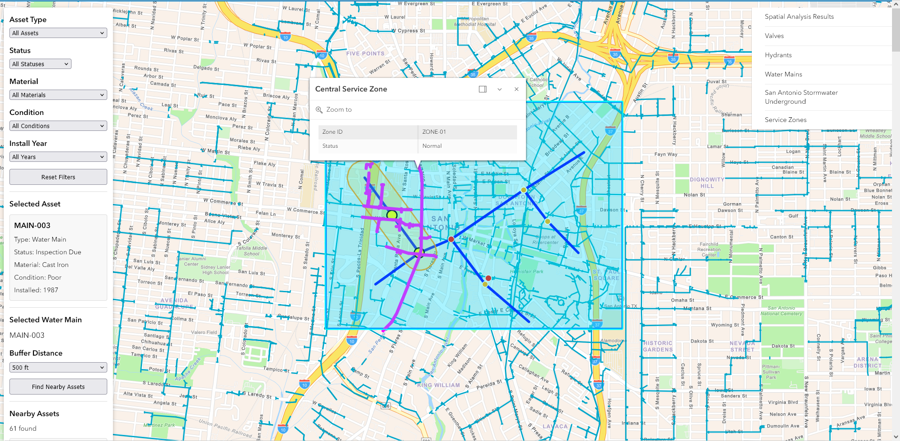

# Water Utility GIS Operations Dashboard

An interactive GIS web application for visualizing, filtering, inspecting, and analyzing utility infrastructure in San Antonio, Texas.

The application combines simulated water utility assets with live public municipal GIS data from the City of San Antonio. It was built to demonstrate practical web GIS development, spatial analysis, external ArcGIS service integration, and utility-oriented operational workflows.

## Live Application

https://water-utility-gis.vercel.app

## Screenshot



## Features

- Interactive ArcGIS map centered on San Antonio, Texas
- Simulated water utility infrastructure, including:
  - Water mains
  - Hydrants
  - Valves
  - Service zones
- Live City of San Antonio stormwater infrastructure loaded from a public ArcGIS Feature Service
- Layer visibility controls
- Asset filtering by:
  - Asset type
  - Status
  - Water-main material
  - Water-main condition
  - Installation year
- Click-to-inspect asset details
- Water-main selection for spatial analysis
- Configurable 250 ft, 500 ft, and 1,000 ft geodesic buffer analysis
- Identification of simulated hydrants and valves within the selected buffer
- Server-side spatial queries against live City of San Antonio stormwater data
- Combined analysis results from simulated and public data sources
- Visual highlighting of spatial-analysis results
- Source labeling that distinguishes simulated assets from public municipal data
- Reset controls for restoring the dashboard to its default state

## Live Municipal GIS Integration

The application consumes a public City of San Antonio ArcGIS Feature Service at runtime:

```text
San Antonio Stormwater Underground
ArcGIS FeatureServer
```

The service provides real municipal stormwater infrastructure represented as line features with attributes including:

- Structure type
- Material
- Diameter
- Year constructed
- Status
- Condition score
- Maintenance responsibility

The layer is loaded directly into the application using the ArcGIS Maps SDK for JavaScript `FeatureLayer` class rather than being copied into the project repository.

This allows the application to work with externally hosted GIS data and perform spatial queries against the live service.

## Spatial Analysis

The dashboard supports mixed-source proximity analysis around selected simulated water mains.

When a water main is selected, the user can choose a buffer distance and run an analysis.

The workflow:

1. Generates a geodesic buffer around the selected water main.
2. Tests simulated hydrant and valve geometries for intersection with the buffer.
3. Sends a spatial intersection query to the live City of San Antonio stormwater Feature Service.
4. Receives matching public stormwater features from the ArcGIS service.
5. Combines simulated and public results into a single analysis result set.
6. Highlights nearby simulated assets and intersecting municipal stormwater features on the map.
7. Identifies the source of each result as either simulated utility data or City of San Antonio public data.

This creates a hybrid GIS workflow that combines local client-side spatial analysis with server-backed ArcGIS feature queries.

## Data Sources

### Simulated Utility Data

The project's simulated utility dataset is stored in:

```text
src/data/utilityData.ts
```

It includes:

- Hydrant locations and inspection information
- Valve locations, types, status, and installation years
- Water-main geometries, materials, conditions, diameters, and installation years
- Service-zone polygon geometry

These assets are intentionally simulated and do not represent actual water utility infrastructure.

### City of San Antonio Public GIS Data

The application also uses live public stormwater infrastructure data from the City of San Antonio through an ArcGIS Feature Service.

The public stormwater layer is queried dynamically at runtime and is not stored locally in the project.

This allows the application to demonstrate integration with a real municipal GIS service while keeping non-public water utility infrastructure simulated.

## Technology Stack

- React
- TypeScript
- Vite
- ArcGIS Maps SDK for JavaScript
- ArcGIS FeatureLayer
- ArcGIS REST Feature Service
- ArcGIS geometry operators
- Vitest
- ESLint
- Git
- GitHub
- GitHub Actions
- Vercel

## GIS Concepts Demonstrated

The project includes hands-on implementation of:

- Point, line, and polygon GIS data
- GIS layers and feature attributes
- ArcGIS Feature Services
- External GIS service integration
- FeatureLayer queries
- Attribute filtering
- Feature inspection and pop-ups
- Geodesic buffering
- Spatial intersection
- Server-side spatial queries
- Mixed-source spatial analysis
- GIS data provenance
- Interactive web mapping

## Testing

Automated tests are implemented with Vitest.

The current test suite validates:

- Presence of utility asset datasets
- Unique asset identifiers
- Valid coordinate ranges
- Valid water-main path geometry
- Service-zone polygon structure
- Supported water-main materials
- Supported water-main conditions
- Water-main filtering behavior
- Combined filtering behavior
- Installation-year filtering

Run the test suite with:

```bash
npm test
```

## Quality Checks

The project uses three primary local quality checks:

```bash
npm test
npm run lint
npm run build
```

These verify automated tests, linting, TypeScript compilation, and the production build.

## Continuous Integration

GitHub Actions runs the project's quality checks automatically on pushes and pull requests to the `main` branch.

The CI workflow:

1. Checks out the repository.
2. Configures Node.js.
3. Installs dependencies with `npm ci`.
4. Runs the Vitest test suite.
5. Runs ESLint.
6. Builds the production application.

The CI badge at the top of this README reflects the current workflow status.

## Project Structure

```text
water-utility-gis/
├── .github/
│   └── workflows/
│       └── ci.yml
├── public/
│   └── images/
│       └── GIS-image.png
├── src/
│   ├── data/
│   │   ├── utilityData.ts
│   │   └── utilityData.test.ts
│   ├── utils/
│   │   ├── filterWaterMains.ts
│   │   └── filterWaterMains.test.ts
│   ├── App.tsx
│   └── main.tsx
├── package.json
└── README.md
```

## Running Locally

Clone the repository:

```bash
git clone https://github.com/richardrhanly-us/water-utility-gis.git
```

Enter the project directory:

```bash
cd water-utility-gis
```

Install dependencies:

```bash
npm install
```

Start the development server:

```bash
npm run dev
```

Then open the local address displayed by Vite.

## Production Build

Create a production build with:

```bash
npm run build
```

The generated production files will be placed in the `dist/` directory.

## Development Goals

This project was built to practice and demonstrate:

- GIS web application development
- ArcGIS Maps SDK development
- ArcGIS Feature Service integration
- Working with real public GIS services
- Spatial data modeling
- Interactive map interfaces
- Geometry-based analysis
- Server-side spatial querying
- React and TypeScript application development
- Testable application logic
- Source control workflows
- Continuous integration
- Production deployment
- Technical documentation

## Disclaimer

Water mains, hydrants, valves, service zones, and associated water utility attributes in this project are simulated and are provided solely for demonstration and software-development purposes.

The San Antonio stormwater infrastructure layer is real public municipal GIS data provided through a City of San Antonio ArcGIS Feature Service. The application does not represent the simulated water utility assets as actual City or SAWS infrastructure.